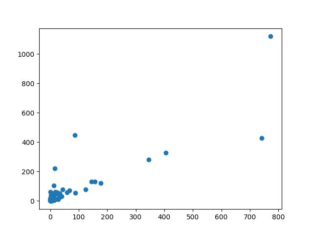
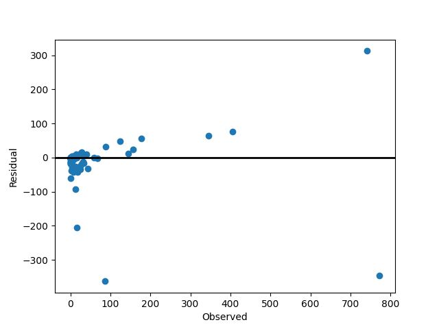
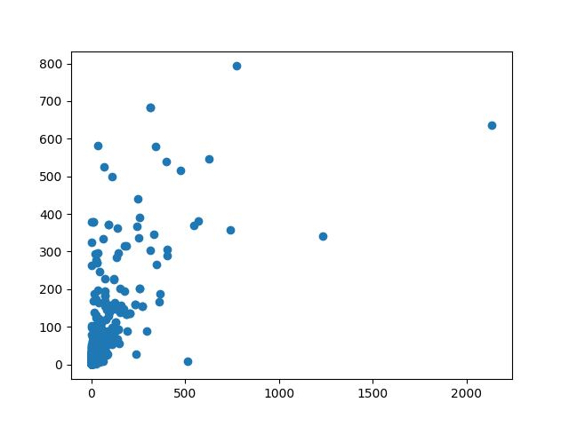
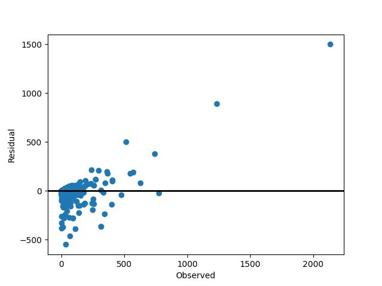

---

marp: true
theme: default
class: - invert

---

# Лабораторная работа

> # Методы регрессионного анализа

## Работу подготовили:

> Панов Олег, Михаил Боровик, Денис Чашин, Анатолий Мезенов, Никита Бабушкин
---

# Входные данные

> 5 тренировочных выборок
> 10 тестовых выборок

Наши выборки содержат информацию о **комментарии** в социальной сети.
* всего комментариев: **число**
* У каждого комментария есть свои атрибуты

---

# Атрибуты (_переменные_)

наш датасет содержит **54** переменные.
> Факторными переменными будут являтся:
> * К-во просмотров
> * Длина поста
> * Категория и т.д.

Одна из которых является целевой - **H Local** 
> описывает H часов, для которых мы получили целевую переменную/комментарии
---

# Постановка задачи

В качестве задания требуется провести регрессионный анализ данных, для того чтобы оценить значение **целевой** переменной на основе **факторных**.

Полученные результаты всех методов **сравним** между собой.
> Грубо говоря, натренировать модели регрессионного анализа данных, выбрать **лучшую** из ~~худших~~ полученных моделей и
> показать полученные результаты.

---

# Выбор моделей

Для решения проблемы классификации мы решили выбрать следующие модели, и распределили их между собой.

- **LS** - Михаил Бабушкин
- **Ridge** - Михаил Бабушкин
- **DT** - Никита Боровик
- **RF** - Никита Боровик
- **KNN** - Олег Панов
- **GB** - Денис Бабушкин
- **KB** Анатолий Мезенов

> И мы расскажем о них подробнее, но сначала

---

# Напомним вам, насколько важен GridSearch
**GridSearchCV** – это ~~до сих пор~~ очень мощный инструмент для автоматического подбирания параметров для моделей машинного обучения. Метод **поиска по сетке** находит наилучшую комбинацию параметров, которые дают **наименьшую ошибку**, путем обычного перебора: **он создает модель для каждой возможной комбинации параметров**.
> Ну а теперь ~~перейдем к моделям~~ расскажем о важном

---
# CV или же кросс-валидация
> И какую же мы имупользуем

**Кросс-валидация** работает путем разделения набора данных на несколько поднаборов, называемых **фолдами**. Затем модель обучается и тестируется несколько раз, каждый раз используя **разные фолды** для тестирования и обучения. 
>
**RepeatedStratifiedKFold** - это вид кросс-валидации, который помогает учесть разнообразие данных и уменьшить вероятность переобучения модели. Его особенностью является стремление **сохранить баланс классов** в каждом фолде

---

# Модель LS
> Least Squares

**LS** заключается в поиске линейной функции, которая наилучшим образом соответствует данным путем минимизации суммы квадратов разницы между фактическими и предсказанными значениями. Метод **оптимизирует сумму квадратов остатков** и находит оптимальные значения коэффициентов линейной модели.

- **Дополнительный плюс** метода состоит в том, что он обеспечивает аналитические _(закрытые)_ решения для оценки коэффициентов линейной модели

- **Но** довольно чуствителен к выбросам. Даже небольшие выбросы могут сильно исказить оценки коэффициентов регрессии и делать предсказания менее точными

---

# Модель Ridge
> Ridge ♪

**Ridge** очень похож на **LS**, ведь он также минимизирует сумму квадратов, но к этой сумме добавляется **штрафование больших значений коэффициентов модели**, что способствует снижению их величины и предотвращает переобучение.

- **Явным плюсом** является стабильность метода, ведь он менее чувствителен к выбросам

- **Но** Из-за регуляризации коэффициенты в Ridge регрессии могут быть менее интерпретируемыми, чем в обычной линейной регрессии, потому что они могут быть уменьшены или даже **занулены**

---
скрин Миши 1

---
скрин Миши 2

---

# Результат работы моделей LS и Ridge

- **R2 Score:** 

- **Медиана:** 

- **Дисперсия:** 

- **СКО:** 

# Подобранные параметры

- Модель: **Ridge**

- Выбранный критерий: **Eigen**

- Shrinkage _(сокращение)_ : **0.01**

---

# Модель DT

> Decision Tree (Регрессионное дерево)

**DT** - это метод регрессии, основанный на построении **дерева решений**, где каждый узел представляет собой тест по одному из признаков. Он разбивает данные на подгруппы на основе значений признаков и прогнозирует целевую переменную для каждой подгруппы

- Чем глубже дерево, тем сложнее правила принятия решений и тем лучше модель.

- Она **хорошо** справляется с обработкой **нелинейных отношений**

- **Но** слишком склонна к переобучению _(возможен случай: хорошо на training, плохо на test)_

---

<h2 align=right>Visualisation for DT model</h2>

---

<h2 align=right>Visualisation for DT model</h2>

---

# Результат работы модели

- **R2 Score:** 0.6934

- **Медиана:** 23.1270

- **Дисперсия:** 4349.8

- **СКО:** 65.953

# Подобранные параметры

- Выбранный критерий: **squared_error**

- Глубина дерева: **10**

- Максимальное к-во листьев: **105**

- Минимальное к-во экземпляров в листе: **85**

---

# Модель RF

> Random Forest

**RF** продолжает идею **DT**, ведь он создает лес из этих деревьев. При предсказании модель **усредняет (или взвешивает) предсказания** всех деревьев, что позволяет уменьшить дисперсию и повысить точность предсказаний.

- **Огромный плюс** - высокая точность модели. Верьте наслово

- **Но также весомый минус -** из-за большого к-ва деревьев, модель может быть очень вычислительно затратна

---

<h2 align=right>Visualisation for RF model</h2>

---

<h2 align=right>Visualisation for RF model</h2>

---

# Результат работы модели

- **R2 Score:** 0.7651

- **Медиана:** 23.0837

- **Дисперсия:** 3332.65

- **СКО:** 57.729

# Подобранные параметры

- Глубина дерева: **15**

- Максимальное к-во листьев: **105**

- Минимальное к-во экземпляров в листе: **55**

- К-во эстиматоров: **50**

---

# Модель KNN

> K Nearest Neighbors (Регрессор "k-ближайших соседей")

Суть **KNN** заключается в том, что он определяет прогноз для нового объекта на основе **среднего** _(или медианного)_ значения целевой переменной у его **ближайших соседей** в обучающей выборке

- Модель **хороша**, поскольку ее метод не использует сложную математику, а реализация проста и очевидна.

- **Но не без проблем**: модель очень вычислительно затратна, особенно на больших наборах данных

---

<h2 align=right>Visualisation for KNN model</h2>

---

<h2 align=right>Visualisation for KNN model</h2>

---

# Результат работы модели

- **R2 Score:** 0.49746

- **Медиана:** 28.980

- **Дисперсия:** 5748.30

- **СКО:** 60.8176

## Подобранные параметры

- Алгоритм: **kd_tree**

- К-во листов: **20**

- К-во соседей: **7**

- Параметр веса: **Расстояние**

---
# Модель GB
> Gradient Boosting
**GB** работает путем последовательного добавления новых **моделей (деревьев)** к существующему ансамблю. Каждое новое дерево обучается на данных, учитывая ошибки, сделанные предыдущими деревьями.

- **плюсом метода** является его способность автоматически учитывать важность признаков

- **Но к сожалению,** она вычислительно затратна и если недостаточно ограничить **глубину деревьев или количество итераций**, модель может переобучиться на обучающих данных, что приведет к плохой обобщающей способности модели.

---
# Модель KB
> Kernel-based regression 

**KB** основана на идее преобразования **признакового пространства**, где данные нелинейны, в более **высокоразмерное** пространство, где зависимость может быть более линейной.
- **плюсом можно выявить** моделирование сложных нелинейных зависимостей между признаками и целевой переменной, что делает его мощным инструментом для аппроксимации разнообразных данных
- **Сложностью является** выбор оптимальных параметров и долгих ~~мучений~~ работ с **GSCV**
---
# Итоги

В ходе проделанной работы было выявлено, что лучшим регрессором для поска целевой переменной оказался метод **НАЗВАНИЕ МЕТОДА** со значением **R2** равным **ЗНАЧЕНИЕ** 🥳🥳🥳

## Почему так?

- в данных мало заметны линейные зависимости
- Выборы деревьев позволяют быть крутыми (??)
- так опять вышло 😁😁😁

---

# Работали,

## Data Balbesing ♂

> это мы ~~пытаемся добавить гифку в пдф~~ следим за выступлениями остальных групп ->
